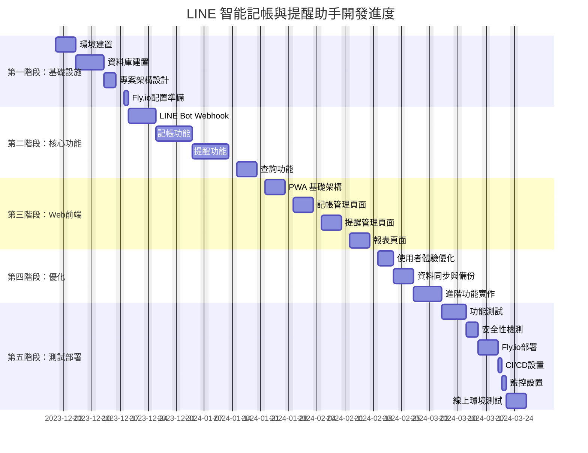

# LINE 智能記帳與提醒助手 - 甘特圖進度表

## 預計總開發時間

- 起始日期：2023-12-01
- 結束日期：2024-02-19 (不含第六階段持續改進)
- 總開發時間：約 11.5 週 (57 個工作日)

## 各階段工作量分配

| 階段 | 工作天數 | 佔比 |
|------|----------|------|
| 第一階段：基礎設施建置 | 12天 | 21% |
| 第二階段：核心功能開發 | 24天 | 42% |
| 第三階段：Web 前端開發 | 20天 | 35% |
| 第四階段：功能完善與優化 | 12天 | 21% |
| 第五階段：測試與部署 | 16天 | 28% |

*注意：各階段可能有部分重疊，百分比總和超過100%*

## 人力資源分配建議

| 角色 | 工作內容 | 人數建議 |
|------|----------|----------|
| 後端開發 | 資料庫、API、邏輯實作 | 1-2人 |
| 前端開發 | PWA、LINE Flex Message | 1人 |
| AI 工程師 | 自然語言處理、語意分析 | 1人 |
| DevOps工程師 | Fly.io部署、CI/CD、監控 | 1人 |
| 測試工程師 | 功能測試、安全測試 | 1人 |
| 專案管理 | 進度追蹤、資源協調 | 1人 |

## 里程碑時間點

1. **概念驗證階段**：2023-12-14
2. **功能測試版本**：2024-01-17
3. **Web 介面測試版本**：2024-02-01
4. **完整測試版本**：2024-02-08
5. **正式發布版本**：2024-02-19 